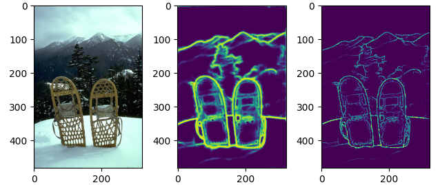

# Non Maximal Suppression


```
import pynms import nms
from PIL import Image
im = np.array(Image.open("assets/2018.jpg"))
edge = np.array(Image.open("assets/2018.png"))
edge_nms = nms(edge)
```

<p align="center">
  
</p>
